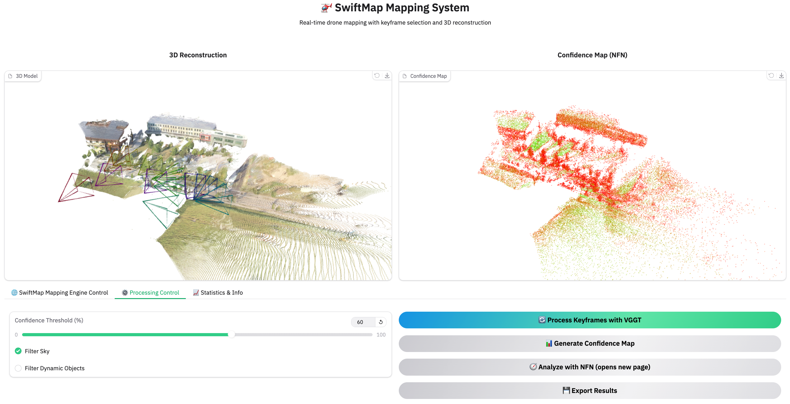

# SwiftMap

SwiftMap is an **AI-in-the-loop, iterative mapping** paradigm that moves toward fast, autonomous, and fully automatic drone mapping. Instead of the traditional *human-in-the-loop, one-pass*
workflow, which needs experienced pilots and hours of offline reconstruction, SwiftMap builds on
Vision Foundation Models (VGGT) to reconstruct dense 3D maps in minutes and to plan the next flight
on the fly.

<p align="center">
  
</p>

*The map gets denser and more complete over multiple flight rounds. Each round shows the total time and the drone's remaining battery.*


If you use SwiftMap in your research, please cite:

```bibtex
@inproceedings{xu2026swiftmap,
  author    = {Xu, Jingao and Chen, Xiangliang and Bala, Mihir and Eiszler, Thomas and
               Chanana, Aditya and Harkes, Jan and Pillai, Padmanabhan and Satyanarayanan, Mahadev},
  title     = {Towards Fast and Fully Automatic Drone Mapping},
  booktitle = {Proceedings of the 24th Annual International Conference on Mobile Systems,
               Applications and Services (MobiSys '26)},
  year      = {2026},
  location  = {Cambridge, United Kingdom},
  publisher = {ACM}
}
```

---

**SwiftMap** turns a stream (or folder) of
drone images into a dense 3D reconstruction and a map-quality evaluation, in three stages:

1. **Keyframe (KF) selection** — only frames with enough contribution will be leveraged for VGGT inference.
2. **VGGT mapping** — the [VGGT](https://github.com/facebookresearch/vggt) model infers camera poses,
   depth, and a 3D point map from the selected keyframes.
3. **Map evaluation + Next Flight Navigation (NFN)** — a confidence-colored point cloud shows where the
   map is reliable, and NFN suggests where to fly next to improve it.

---

## Repository layout

```
SwiftMap/
├── launch_mapping.py        # Entry point — launches the Gradio web GUI
├── pyproject.toml           # Dependencies (managed with uv)
├── swiftmap/                # The SwiftMap package
│   ├── core/                # Domain logic
│   │   ├── tcp_server.py            # TCP keyframe-collection server
│   │   ├── keyframe_selector/       # optical-flow keyframe selection (+ frame_tracker)
│   │   ├── mapper/                  # Pluggable reconstruction backbones:
│   │   │                            #   base.py (BaseMapper) + registry + backends/{vggt,vggt_omega}
│   │   │                            #   + shared postprocess / scene_export / confidence / geometry
│   │   └── nfn/                     # Next Flight Navigation planner
│   └── frontend/            # Gradio web UI, gradio compat shim, Viser viewer
└── test/                    # test_client.py (streaming client)
```

The reconstruction models (VGGT, VGGT-Omega) are external packages installed
into the environment, not vendored in-tree — see the optional dependencies in
`pyproject.toml`.

---

## Installation

SwiftMap uses [uv](https://docs.astral.sh/uv/) to manage its Python environment.

```bash
git clone <YOUR_REPO_URL> SwiftMap
cd SwiftMap

uv sync          # creates .venv and installs all dependencies from the lockfile
```

Then run any command with `uv run …` (no environment to activate). The VGGT model weights
(`facebook/VGGT-1B`) download automatically from Hugging Face on the first run. A CUDA GPU is
strongly recommended.

### Get test data

Download the sample drone images here:

> **Test images:** `<DOWNLOAD_LINK>`  *(provided separately)*

Unzip them into a folder, e.g. `data/test_images/` (a flat folder of `.jpg` / `.png` frames). Use this
folder wherever a directory of images is needed below.

---

## Running SwiftMap

Start the web interface:

```bash
uv run python launch_mapping.py
```

(`--host` and `--gui-port` override the bind address and port; run
`uv run python launch_mapping.py --help` for the full list.)

Open the printed URL (default **http://localhost:7866**). The page has two 3D viewers on top
(**3D Reconstruction** and **Confidence Map**) and three control tabs below. Follow the steps in order:

<p align="center">
  
</p>

*The SwiftMap web GUI: the two 3D viewers sit on top, and the control tabs referenced in the steps
below are along the bottom.*

### 1. Collect keyframes  (tab: **🌐 SwiftMap Mapping Engine Control**)
* Set **TCP Port** (default `43322`) and **Min Disparity Threshold** (how much motion before a new
   keyframe is taken — larger = fewer keyframes).
* Click **🚀 Start SwiftMap Mapping Engine**. **Server Status** turns to running.
* Stream images to it (from another terminal):
   ```bash
   uv run python test/test_client.py --host localhost --port 43322 \
          --image-dir data/test_images --delay 0.1
   ```
   Watch **Collected Keyframes** go up. (Use **🗑️ Clear Keyframes** to start over.)

### 2. Reconstruct  (tab: **⚙️ Processing Control**)
* Set **Confidence Threshold (%)** and, if you like, **Filter Sky** / **Filter Dynamic Objects**.
* Click **🔄 Process Keyframes with VGGT**. The **3D Reconstruction** viewer (top-left) fills in.

### 3. Evaluate map quality  (tab: **⚙️ Processing Control**)
- Click **📊 Generate Confidence Map**. The **Confidence Map** viewer (top-right) shows a red→green cloud
  (red = low quality, green = high quality).

### 4. Plan the next flight (NFN)  (tab: **⚙️ Processing Control**)
- Click **🧭 Analyze with NFN**. SwiftMap finds the regions worth re-flying and opens an interactive
  **Viser** viewer in a separate page (default **http://localhost:8080** — use the link shown next to the
  button, or open it manually). There you see 🔴 to-improve regions, 🔵 suggested next viewpoints, and
  🟢 your existing cameras over the point cloud. The **candidate viewpoint positions and orientations**
  are also written to the **Processing Log** (see Step 6).

### 5. Export  (tab: **⚙️ Processing Control**)
- Click **💾 Export Results** to write the camera poses to the run's output folder.

### 6. Monitor  (tab: **📈 Statistics & Info**)
- **Live Statistics** shows server/keyframe status; **Processing Log** shows messages and the NFN
  candidate viewpoint list (position + look direction for each suggested camera).

---

## Output

Each run writes a timestamped directory in the working folder:

```
input_stream_YYYYMMDD_HHMMSS/
├── images/             # the selected keyframes
├── sky_masks/          # sky masks (if sky filtering is on)
├── scene.glb           # 3D reconstruction
├── confidence_map.glb  # map-quality (confidence) visualization
├── pointcloud_*.ply    # point cloud export
├── predictions.npz     # raw VGGT outputs
└── camera_poses.json   # estimated camera poses
```

Open the `.glb` / `.ply` files in any 3D viewer (MeshLab, Blender, …).

---

## TCP protocol

The streaming server speaks a simple binary protocol (used by `test/test_client.py`):

1. Send the image size as **4 bytes, big-endian unsigned int**.
2. Send the **JPEG-encoded** image bytes.

---

## Acknowledgements

- **VGGT** (Visual Geometry Grounded Transformer), Meta AI — the bundled `vggt/` package and the
  `facebook/VGGT-1B` weights. See https://github.com/facebookresearch/vggt.
- **VGGT-SLAM** — inspiration for the optical-flow keyframe-selection algorithm.

## License

SwiftMap is made of two parts with **different licenses**:

| Part | Files | License |
|------|-------|---------|
| **SwiftMap** (our own code) | `swiftmap/` | **GNU GPL v2** — see [`LICENSE`](./LICENSE) |
| **VGGT** (vendored from Meta) | `vggt/`  | **CC BY-NC 4.0** — see [`vggt/LICENSE`](./vggt/LICENSE) |

The bundled `vggt/` package is from
[`facebookresearch/vggt`](https://github.com/facebookresearch/vggt) at commit **`b0057ad`**
(2025-07-14), which — together with the `facebook/VGGT-1B` weights — is licensed under **Creative
Commons Attribution-NonCommercial 4.0 (CC BY-NC 4.0)**.
