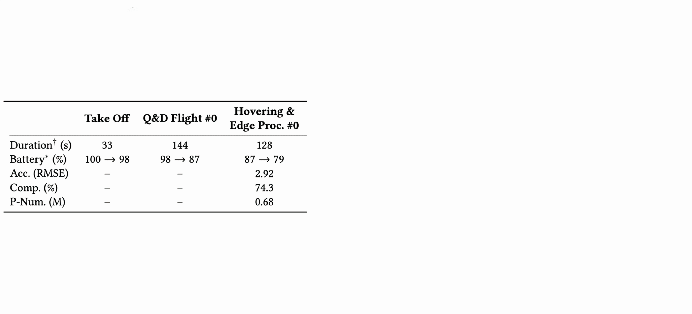

# SwiftMap

SwiftMap is an **AI-in-the-loop, iterative mapping** paradigm that moves toward fast, autonomous,
and fully automatic drone mapping. Instead of the traditional *human-in-the-loop, one-pass* workflow —
experienced pilots plus hours of offline reconstruction — SwiftMap builds on vision foundation models
to reconstruct dense 3D maps in minutes and plan the next flight on the fly.

<p align="center">
  
</p>

*The map gets denser and more complete over multiple flight rounds. Each round shows the total time and
the drone's remaining battery.*

If you use SwiftMap in your research, please cite:

```bibtex
@inproceedings{xu2026swiftmap,
  author    = {Xu, Jingao and Chen, Xiangliang and Bala, Mihir and Eiszler, Thomas and
               Chanana, Aditya and Harkes, Jan and Pillai, Padmanabhan and Satyanarayanan, Mahadev},
  title     = {Towards Fast and Fully Automatic Drone Mapping},
  booktitle = {Proceedings of the 24th Annual International Conference on Mobile Systems,
               Applications and Services (MobiSys '26)},
  year      = {2026},
  location  = {Cambridge, United Kingdom},
  publisher = {ACM}
}
```

---

## What it does

SwiftMap turns a stream (or folder) of drone frames — each optionally carrying a GPS fix — into a dense
3D reconstruction, a map-quality evaluation, a next-flight plan, and (optionally) geolocated objects:

1. **Keyframe selection** — optical-flow disparity keeps only frames that add enough new viewpoint.
2. **Reconstruction** — a pluggable backbone infers camera poses, depth, and a 3D point map.
   Two are built in: [**VGGT**](https://github.com/facebookresearch/vggt) (point head) and
   **VGGT-Omega** (depth-based).
3. **Evaluation + Next Flight Navigation (NFN)** — a confidence-colored cloud shows where the map is
   reliable; NFN clusters the weak regions and suggests where to fly next.
4. **Segmentation (optional)** — a text query (e.g. `person`) is segmented per frame with
   [**SAM 3**](https://github.com/facebookresearch/sam3) and lifted to 3D via the point map; clustered
   objects become GPS waypoints.
5. **GPS alignment** — the reconstruction is fit to the streamed GPS, so NFN viewpoints and segmented
   objects export as lat/lon (JSON + KML for Google My Maps).

One entry point drives the core: `launch_server.py` (`swiftmap.server`) — a container that
auto-runs the whole pipeline at the keyframe cap (for SteelEagle) and serves results through its
own viewer.

---

## Repository layout

```
swift_map/
├── launch_server.py          # headless auto-mapping server entry point
├── Dockerfile                # server container image
├── pyproject.toml            # deps (uv); model backbones are optional extras
├── swiftmap/
│   ├── core/
│   │   ├── session.py            # MappingSession — the single gateway to the core
│   │   ├── constants.py
│   │   ├── transport/            # ingest: protocol.py, tcp_server.py, keyframe_selector/
│   │   ├── database/             # the store: Map (+MapMetaData), Site (growing map), Database
│   │   └── pipeline/             # post-batch stages, each taking a Map
│   │       ├── reconstructor/        # pluggable backbones (base, registry, backends/, postprocess, sky_mask)
│   │       ├── gps_transformer/      # local ↔ GPS (Umeyama / ICP)
│   │       ├── segmentor/            # text-prompt segmentation (SAM 3) + 3D lift
│   │       ├── next_flight_planner/  # NFN planner + plan/KML export
│   │       └── utils/                # geometry, kml, confidence, render helpers
│   └── server/                   # AutoMappingServer (grow-and-merge) + results viewer
└── test/test_client.py       # streaming test client
```

The reconstruction backbones (VGGT, VGGT-Omega) and the segmenter (SAM 3) are **external packages**,
installed as optional extras — nothing model-specific is vendored in-tree.

---

## Installation

SwiftMap uses [uv](https://docs.astral.sh/uv/). A CUDA GPU is strongly recommended.

```bash
git clone <YOUR_REPO_URL> swift_map
cd swift_map
uv sync                        # core deps into .venv
```

Then install the backbone(s) and segmenter you want (declared as extras in `pyproject.toml`):

```bash
# reconstruction backbones
uv pip install "vggt @ git+https://github.com/facebookresearch/vggt.git@c3953fab"
uv pip install "vggt-omega @ git+https://github.com/facebookresearch/vggt-omega.git@39a0cb8"

# segmentation (SAM 3 still imports pkg_resources -> setuptools must stay <81)
uv pip install "sam3 @ git+https://github.com/facebookresearch/sam3.git" "setuptools<81" pycocotools
```

Weights: **VGGT** (`facebook/VGGT-1B`) and **SAM 3** (`facebook/sam3`) download from Hugging Face on
first use. **VGGT-Omega** needs a local checkpoint — set `VGGT_OMEGA_CHECKPOINT=/path/to/…512.pt`.

Run anything with `uv run …` (no venv to activate).

---

## Run the server

The server collects frame+GPS pairs and, once the keyframe cap fills, **auto-runs the whole pipeline**
(reconstruct → GPS-align → NFN) and grows a single merged site under the output directory.

```bash
uv run python launch_server.py \
    --backbone vggt --seg-queries person,car --max-keyframes 70 --output-dir output
```

All flags have env equivalents (see `python launch_server.py --help`):

| Env | Default | Meaning |
|---|---|---|
| `SWIFTMAP_PORT` | `43322` | TCP ingest port |
| `SWIFTMAP_BACKBONE` | `vggt` | `vggt` \| `vggt_omega` |
| `SWIFTMAP_SEG_QUERIES` | *(empty)* | comma list; empty disables segmentation |
| `SWIFTMAP_MAX_KEYFRAMES` | `70` | keyframe count that triggers a run |
| `SWIFTMAP_CONF_THRESHOLD` | `60` | confidence percentile cut |
| `SWIFTMAP_CONTINUOUS` | `true` | after a run, clear and map the next batch |
| `SWIFTMAP_OUTPUT_DIR` | `output` | export dir (mount this in Docker) |

---

## Docker / SteelEagle deployment

SwiftMap plugs into the [SteelEagle](https://github.com/cmusatyalab/steeleagle) backend as a mapping
server that the **SwiftMap cognitive engine** forwards to (like the SLAM engine → TerraSLAM).

1. **Build the server image** from this repo:
   ```bash
   docker build -t cmusatyalab/steeleagle-swiftmap-server:latest .
   ```
2. **Run it via the SteelEagle compose** (the `swiftmap-server` + `swiftmap-engine` services):
   ```bash
   cd steeleagle/backend/server && cp template.env .env   # edit as needed
   docker compose up swiftmap-server swiftmap-engine
   ```

The cognitive engine is **distance-gated**: it forwards at most one frame+GPS pair per
`SWIFTMAP_SEND_DISTANCE` meters of travel (default 5 m) so it never overfills the server; the server
still does its own keyframe selection. Exports land on the host via the mounted volume
(`steeleagle-vol/swiftmap/`).

**Data flow:** drone → Gabriel → swiftmap-engine (1 pair / 5 m) → TCP → swiftmap-server (map at cap) →
`output/input_stream_<timestamp>/`.

---

## Output

Each run writes a timestamped directory:

```
input_stream_YYYYMMDD_HHMMSS/
├── images/                       # the keyframes used
├── scene.glb                     # 3D reconstruction
├── confidence_map.glb / .ply     # map-quality (confidence) cloud
├── pointcloud_*.ply              # point cloud
├── predictions.npz               # raw backbone outputs
├── camera_poses.json             # estimated camera poses
├── next_flight_viewpoints.json   # NFN plan (+ GPS when aligned)
├── next_flight_viewpoints.kml    # NFN target pins (Google My Maps)
├── next_flight_area.kml          # NFN coverage polygon
├── transform.json                # local→GPS fit (when aligned)
├── segmented_<query>.glb         # highlighted segmentation cloud
└── segmented_objects.json / .kml # per-object centroids (+ GPS)
```

Open the `.glb` / `.ply` in any 3D viewer (MeshLab, Blender, …); import the `.kml` into Google My Maps.

---

## TCP protocol

`swiftmap/core/protocol.py` is the single source of truth. Per frame, a client sends:

```
[ 4-byte big-endian uint32   image size            ]
[ <image size> bytes         JPEG image            ]
[ 24-byte 3×float64          GPS: lat, lon, alt    ]   (NaN triple = no GPS)
```

and the server replies with `3×float64` `(status, keyframe_count, total_frames)`. See
`test/test_client.py` for a reference client.

---

## Acknowledgements

- **VGGT** (Visual Geometry Grounded Transformer), Meta AI — reconstruction backbone
  (`facebook/VGGT-1B`). https://github.com/facebookresearch/vggt
- **VGGT-Omega** — depth-based reconstruction backbone.
- **SAM 3** (Segment Anything Model 3), Meta AI — text-prompt segmentation.
  https://github.com/facebookresearch/sam3
- **VGGT-SLAM** — inspiration for the optical-flow keyframe-selection heuristic.
- **TerraSLAM** — GPS-alignment (Umeyama/ICP) approach.

## License

The SwiftMap code (`swiftmap/`, `launch_*.py`) is licensed under **GNU GPL v2** — see
[`LICENSE`](./LICENSE). The reconstruction backbones and segmenter are **external dependencies** with
their own licenses; note that **VGGT** (`facebook/VGGT-1B`) is **CC BY-NC 4.0 (non-commercial)**, which
governs its use regardless of how SwiftMap is licensed.
